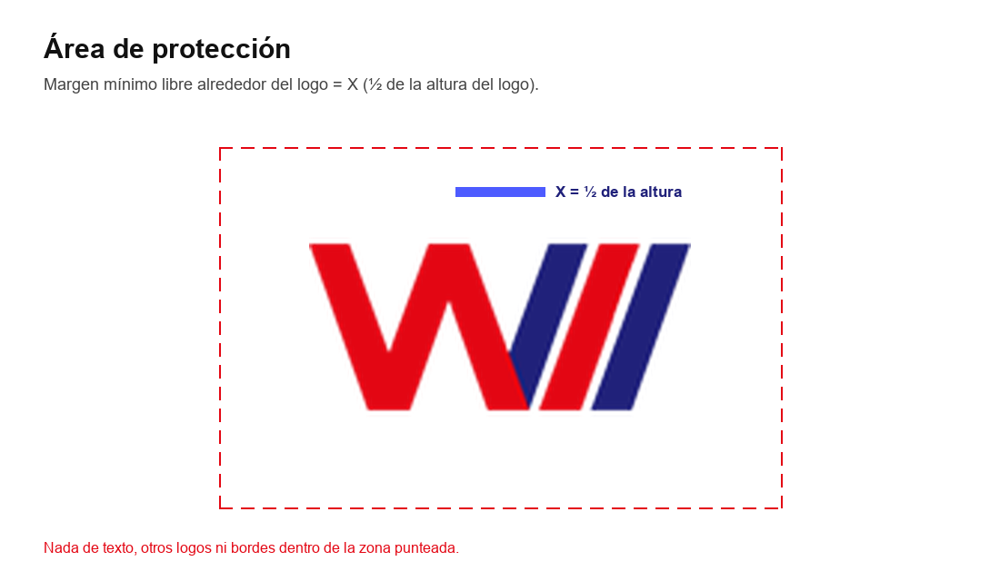
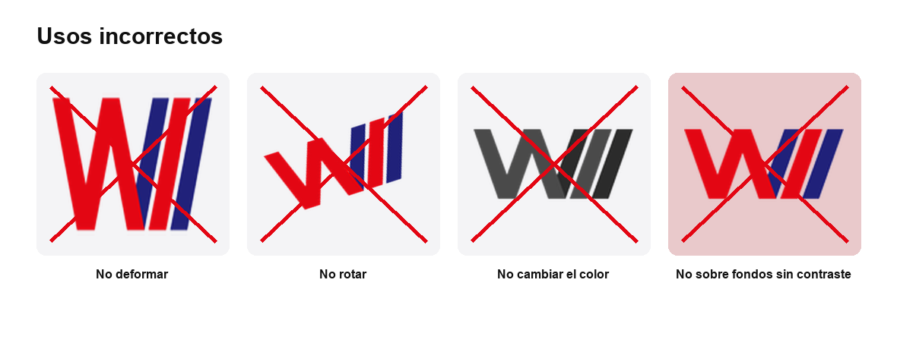
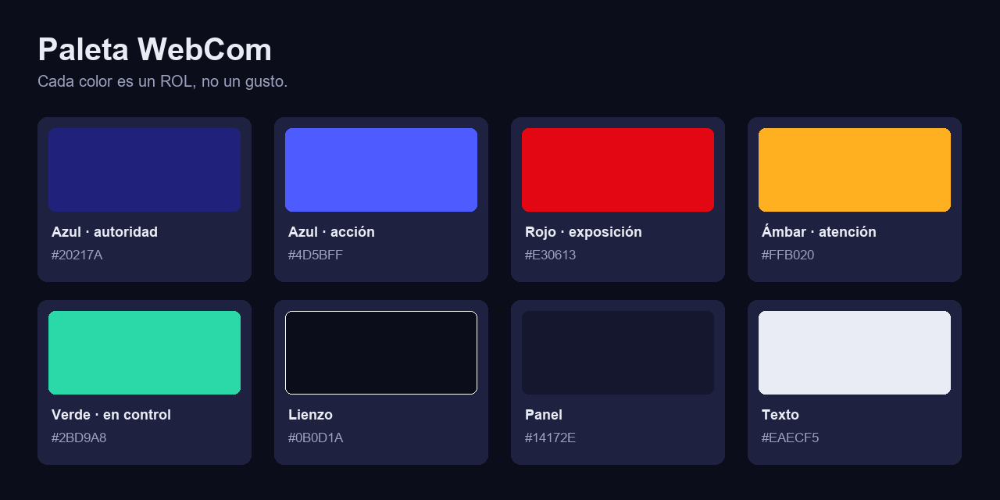
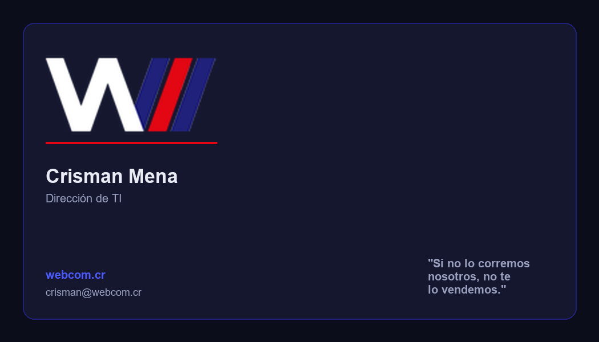
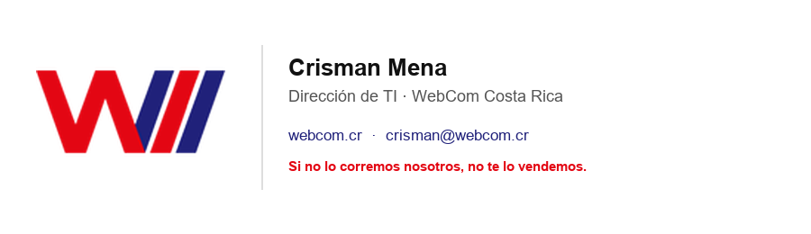

# Libro de Marca — WebCom Costa Rica

> Manual completo de la identidad WebCom. Para el **por qué** estratégico, ver [FUNDAMENTO-DE-MARCA.md](../FUNDAMENTO-DE-MARCA.md). Para la **referencia rápida** de devs/IAs, ver [BRAND_GUIDE.md](../BRAND_GUIDE.md). Vista visual en vivo: [`preview.html`](../preview.html).

**Versión 1.0 · Sistema visual "Sala de Control"**

---

## Índice

1. [La marca](#1-la-marca)
2. [Personalidad y tono de voz](#2-personalidad-y-tono-de-voz)
3. [El logotipo](#3-el-logotipo)
4. [Color](#4-color)
5. [Tipografía](#5-tipografía)
6. [Elementos gráficos](#6-elementos-gráficos)
7. [Aplicaciones](#7-aplicaciones)
8. [Recursos](#8-recursos)

---

## 1. La marca

**WebCom Costa Rica** le devuelve a los directores de TI algo que el mercado les quitó: **claridad**. Saber, de verdad, qué tan expuestos están.

- **Propósito:** terminar con las cajas negras. Darle al director de TI visibilidad y control de su propia casa.
- **A quién le hablamos:** directores de TI (foco de arranque: colegios profesionales).
- **Declaración de unicidad:** *Para los directores de TI, WebCom es el único socio que te muestra —medido y en claro— qué tan expuesto estás de verdad; porque no te vendemos nada que no corramos, midamos y suframos primero en nuestra propia casa.*
- **Mantra:** **"Si no lo corremos nosotros, no te lo vendemos."**
- **El villano:** el **humo** — el proveedor que marea con siglas, el miedo que se vende, la opacidad.

---

## 2. Personalidad y tono de voz

Una marca que vende **claridad** no puede hablar enredado. La forma de hablar es la prueba viviente de la promesa.

| Rasgo | Qué significa |
|---|---|
| **Directo y sin humo** | Las cosas como son, hasta las incómodas. Frases cortas. |
| **De colega a colega** | Le hablamos a un par que estuvo en la trinchera, no a un "usuario". |
| **Honesto con cicatrices** | Mostramos lo que rompimos y arreglamos. La vulnerabilidad da confianza. |
| **Claro por obsesión** | Traducimos lo técnico, matamos el jerga. |

### Verbal — HACER / NO HACER

| HACER | NO HACER |
|---|---|
| "Te mostramos, medido, qué tan expuesto estás." | "Soluciones sinérgicas de clase mundial." |
| "Esto lo rompimos nosotros primero." | Vender miedo o urgencia falsa. |
| Segunda persona, claro y corto. | Siglas sin explicar. Relleno corporativo. |
| Mostrar el número, la métrica, la prueba. | Prometer lo que no corremos nosotros. |

---

## 3. El logotipo

El logotipo es la marca "WII" — la doble V/W con las barras de velocidad. Es lo único que no se rediseña ni se recrea.

### 3.1 Versiones

| Variante | Archivo | Uso |
|---|---|---|
| Rojo (principal) | [`wccr-logo-rojo.png`](../assets/logos/wccr-logo-rojo.png) | Fondos claros |
| Blanco | [`wccr-logo-blanco.png`](../assets/logos/wccr-logo-blanco.png) | Fondos oscuros o con color (uso principal del sistema dark) |
| Negro | [`wccr-logo-negro.png`](../assets/logos/wccr-logo-negro.png) | Monocromático, impresión B/N |
| Máster (alta res.) | [`wccr-logo-master-rojo.png`](../assets/logos/wccr-logo-master-rojo.png) | Origen para producir otros tamaños |

> En el sistema "Sala de Control" (dark-first), la versión **blanca** es la de uso más frecuente.

### 3.2 Área de protección y tamaño mínimo

- **Área de protección:** un margen libre igual a **X = ½ de la altura del logo** en los cuatro lados. Nada (texto, otros logos, bordes) entra en esa zona.
- **Tamaño mínimo:** 24 px de alto en pantalla · 12 mm de alto en impresión. Por debajo, la marca pierde legibilidad.

### 3.3 Usos incorrectos

No deformar · No rotar · No cambiar los colores · No colocar sobre fondos sin contraste. Tampoco: agregar sombras/efectos, recrear el logo, ni encajonarlo dentro del área de protección.

### 3.4 Pendiente de producción
- **SVG vectorial** del logo (hoy solo hay PNG). Necesita un diseñador para vectorizar el máster.
- Favicon e iconos de app derivados de la marca.

---

## 4. Color

### 4.1 Roles (no decoración)

| Rol | Hex | Token | Uso |
|---|---|---|---|
| Azul · autoridad | `#20217A` | `--wccr-azul` | Base de marca, confianza |
| Azul · acción | `#4D5BFF` | `--wccr-primary` | Botones, links |
| Rojo · exposición | `#E30613` | `--wccr-danger` | Alerta, riesgo |
| Ámbar · atención | `#FFB020` | `--wccr-warning` | Advertencias, puntos ciegos |
| Verde · en control | `#2BD9A8` | `--wccr-ok` | Éxito, seguro |
| Lienzo | `#0B0D1A` | `--wccr-bg` | Fondo base |
| Panel | `#14172E` | `--wccr-surface` | Tarjetas, paneles |
| Texto | `#EAECF5` | `--wccr-text` | Texto sobre oscuro |

### 4.2 Proporciones de uso

Pensá en un tablero, no en un afiche:
- **~70 %** superficies oscuras (lienzo + paneles).
- **~20 %** texto y neutros.
- **~10 %** color: el **azul** lleva la acción; el **rojo se usa con cuentagotas**, solo para señalar exposición/alerta. Si todo es rojo, nada es alerta.

### 4.3 Semántica = niveles del Test

Los tres colores de estado mapean exactamente al [Test de Exposición](test-exposicion.md):

| Color | Nivel |
|---|---|
| 🔴 Rojo | A ciegas (0–6) |
| 🟡 Ámbar | Con puntos ciegos (7–11) |
| 🟢 Verde | En control (12–16) |

### 4.4 Contraste
El texto principal `#EAECF5` sobre lienzo `#0B0D1A` supera holgado AA/AAA. El rojo `#E30613` sobre oscuro sirve para acento/estado; **no** para texto largo.

---

## 5. Tipografía

Tres familias libres (Google Fonts), cada una con un trabajo.

| Rol | Fuente | Token |
|---|---|---|
| Títulos | **Space Grotesk** | `--wccr-font-display` |
| Cuerpo / UI | **Inter** | `--wccr-font-body` |
| Datos / métricas | **JetBrains Mono** | `--wccr-font-mono` |

### Jerarquía y escala

| Nivel | Fuente / peso | Tamaño |
|---|---|---|
| Display / H1 | Space Grotesk 700 | 44 px |
| H2 | Space Grotesk 600 | 32 px |
| H3 | Space Grotesk 600 | 24 px |
| Overline / etiqueta | Space Grotesk 600 · MAYÚS · tracking | 13 px |
| Cuerpo grande | Inter 400 | 18 px |
| Cuerpo | Inter 400 | 16 px |
| Pequeño | Inter 400 | 14 px |
| Dato / lectura | JetBrains Mono 400–600 | 16 px (grandes: 48–64 px) |

> **El mono es la firma del instrumento.** Usalo para puntajes, métricas, estados y código — no para párrafos.

---

## 6. Elementos gráficos

El sistema visual se comporta como un **panel de instrumentos de seguridad**.

- **Medidores (gauges) y barras de estado:** muestran el "nivel de exposición" como número en mono + barra de color semántico. Es el motivo gráfico central (ver hero en [`preview.html`](../preview.html)).
- **Semáforo de estado:** rojo / ámbar / verde como lenguaje constante de "expuesto / atención / en control".
- **Grilla de puntos sutil:** textura de fondo (puntos a baja opacidad) que evoca una pantalla técnica, sin ruido.
- **Línea de acento roja:** un trazo rojo corto como subrayado/separador — la "luz de alerta" del tablero.
- **Iconografía (pendiente de producción):** estilo *line icons*, trazo uniforme (~2 px), esquinas a 90°/precisas. Coherente con "preciso, no decorativo".

---

## 7. Aplicaciones

### 7.1 Tarjeta personal

Fondo oscuro, logo blanco, línea de acento roja, mantra como cierre.

### 7.2 Firma de correo

Versión clara para clientes de correo: logo rojo, datos en azul, mantra en rojo.

### 7.3 Redes sociales (spec)
- Avatar: el logo "WII" o las barras, centrado, sobre lienzo `#0B0D1A`, respetando área de protección.
- Plantilla de post: fondo oscuro + grilla de puntos, titular en Space Grotesk, dato/estadística en mono, acento rojo. Formato regla 9-1-1 (ver [playbook](playbook-de-activacion.md)).

### 7.4 Web (próxima fase)
El sitio consume directamente los [`tokens/`](../tokens). Hero = el medidor de exposición. Ver mensajería en [mensajeria.md](mensajeria.md).

### 7.5 Presentaciones (spec)
Fondo lienzo, una idea por lámina, dato grande en mono, logo blanco en esquina.

---

## 8. Recursos

| Recurso | Ubicación |
|---|---|
| Tokens (CSS/JSON/Tailwind) | [`tokens/`](../tokens) |
| Logos | [`assets/logos/`](../assets/logos) |
| Diagramas | [`assets/diagramas/`](../assets/diagramas) |
| Aplicaciones | [`assets/aplicaciones/`](../assets/aplicaciones) |
| Preview visual en vivo | [`preview.html`](../preview.html) |
| Fuentes | Space Grotesk · Inter · JetBrains Mono (Google Fonts) |
| Generador de diagramas | [`scripts/gen_diagramas.py`](../scripts/gen_diagramas.py) |

---

### Pendiente de producción (necesita diseñador)
- SVG vectorial del logo · favicon e iconos de app · set de iconografía · fotografía/estilo de imagen · plantillas editables (papelería, presentaciones).

> Guardián de la marca: este repositorio es la fuente de verdad. Todo cambio se versiona acá y se propaga a los productos.
